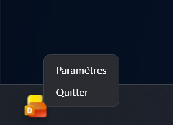
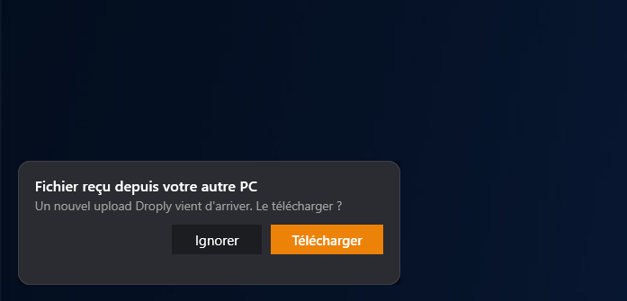
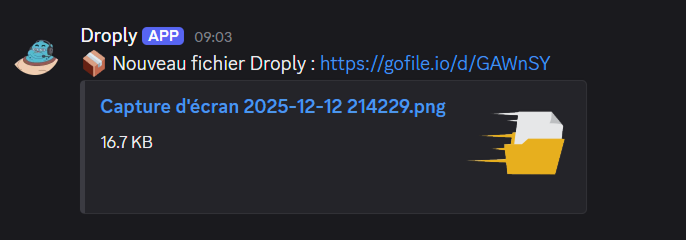

  
  <h1>Droply</h1>
  
<b>Limitless file sharing & multi-device sync. Right from your taskbar.</b>

---

**Droply** is a lightweight, minimalist Windows utility designed for instant file sharing and inter-PC synchronization. Docked perfectly onto your Windows taskbar, it bypasses standard file-size limits, allowing you to share massive payloads up to **100GB** effortlessly. Drag, drop, and share—it's that simple.

---

## 💎 A Premium Windows Experience

Droply is built to feel like a native extension of your operating system. From Fluent Design animations to intelligent taskbar auto-hiding, every interaction is engineered to be seamless.

  
  
  

---

## ✨ Key Features

* **Drag & Drop Simplicity**: Just drag any file onto the app icon docked right above your Windows taskbar. The link is automatically copied to your clipboard upon completion.
* **Magic Portal (Inter-PC Sync)**: Seamlessly link multiple PCs. Drop a file on your Desktop, and instantly receive a push notification to download it on your Laptop.
* **Massive 100GB Uploads**: Droply dynamically calculates your file size before transmission and automatically routes it through the most optimized API to bypass traditional 2GB limits.
* **Discord Integration**: Maintain a clean, automated log of your shared files by linking an optional Discord webhook, generating rich embed cards inside your server.
* **Unintrusive & Smart**: Droply respects your workspace. It auto-hides when the Windows Start Menu is open or the taskbar is minimized, ensuring zero visual overlap.
* **Live Localization**: Switch instantly between English, French, and other supported languages directly from the settings, with zero app restarts required.

---

## 🚀 Getting Started

### 1. Basic Installation & Setup
1. Download the latest pre-compiled `Droply.exe` package from the [Releases page](https://github.com/legralltitouan/Droply/releases).
2. Place the executable in your preferred directory and launch it.
3. **Right-click** the Droply icon on your taskbar (or reference the context menu below) to open **Settings**.
4. Configure your preferred theme (Light/Dark mode), language, and startup behaviors.

  

---

### 2. Setting Up "Magic Portal" (PC-to-PC Sync)
Link your devices to send files directly between your own computers.

1. Go to the [Discord Developer Portal](https://discord.com/developers/applications) and create a **New Application**.
2. Under the **Bot** tab, click **Reset Token** and copy the generated key (*Bot Token*). 
3. **⚠️ Crucial Step:** On the same Bot page, scroll down and enable the **MESSAGE CONTENT INTENT** toggle.
4. Go to **OAuth2 > URL Generator**. Check the `bot` scope, and under Bot Permissions, check `View Channels` and `Read Message History`. Open the generated link to invite the bot to your private Discord server.
5. In your Discord app, right-click the channel you want to use for syncing and click **Copy Channel ID** *(Requires Developer Mode enabled in Discord)*.
6. Open Droply's Settings, navigate to the **DISCORD SYNC** tab, and paste your **Bot Token** and **Channel ID** on *both* computers.
7. Click **Save & Close**. 

> **Result:** When you drop a file on PC "A", a sleek Toast Notification will appear on PC "B". Click *Download*, and the file will securely transfer to your machine!

  

---

### 3. Discord Webhook Logging (Optional)
If you just want a log of your uploads without PC-to-PC sync:
1. Create a Webhook in any Discord channel settings.
2. Paste the URL into the **Discord Webhook** field in Droply's settings.
3. Every successful upload will instantly generate a rich embed like this:

  

---

## 🤝 Contributing

Contributions make the open-source community an amazing place to learn, inspire, and create. If you have optimization proposals or encounter bugs:

1. Open a tracking [Issue](https://github.com/legralltitouan/Droply/issues).
2. Fork the repository.
3. Create your Feature Branch (`git checkout -b feature/AmazingFeature`).
4. Commit your Changes (`git commit -m 'Add some AmazingFeature'`).
5. Push to the Branch (`git push origin feature/AmazingFeature`).
6. Open a Pull Request.

---

## 📝 License

This project is licensed under the terms of the **MIT License**. Check out the `LICENSE` documentation for detailed clauses.

**Copyright (c) 2026 legralltitouan**
*Note: Non-commercial use only. Any modification or distribution of this software requires written permission from the author.*
