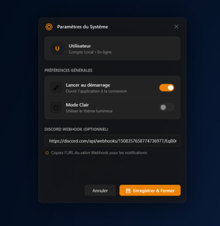
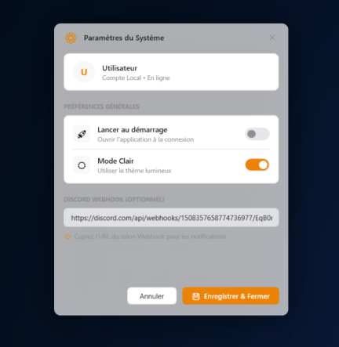

#    Droply

---

**Droply** is a lightweight, minimalist Windows utility designed for instant file sharing and multi-device synchronization. Drag, drop, and share—it's that simple. Docked perfectly onto your Windows taskbar, Droply breaks past standard file size limits, allowing you to share massive payloads up to **100GB** effortlessly.

---

## 📸 Preview

### Core Workflow
| Idle State | Uploading | Success |
| :---: | :---: | :---: |
|  |  |  |

### Magic Portal & Settings
| Magic Portal Sync | Settings (Dark Mode) | Settings (Light Mode) |
| :---: | :---: | :---: |
|  |  |  |

---

## ✨ Key Features

* **Drag & Drop Simplicity**: Just drag any file onto the app icon docked right above your Windows taskbar.
* **Magic Portal (Inter-PC Sync)**: Link multiple PCs using a Discord Bot. Drop a file on your Desktop, and instantly receive a notification to download it on your Laptop.
* **Massive 100GB Uploads**: Droply dynamically calculates your file size and automatically routes it through the best available service to bypass traditional 2GB limits.
* **Discord Integration**: Keep a log of your shared files by linking an optional Discord webhook, which generates clean embed cards inside your server.
* **Seamless Windows Integration**: Built to look and feel like a native Windows app. It features smooth Fluent Design animations, respects your Light/Dark mode preferences, and hides intelligently when the Start Menu is open or the taskbar auto-hides.
* **Multi-Language Support**: Switch between English and other supported languages instantly from the settings menu.

---

## 🔀 Smart Routing Engine

You don't need to worry about file sizes. Droply automatically guarantees your file is uploaded using the fastest and most stable service available:

| File Size | Service Used | Best For |
| :--- | :--- | :--- |
| **0 MB – 2 GB** | Gofile.io | Lightning-fast transfers for everyday files. |
| **2 GB – 25 GB** | Storage.to | Heavy media, video projects, and archives. |
| **25 GB – 100 GB** | Pixeldrain.com | Massive payloads and full system backups. |

---

## 🚀 How to Use & Configure

1. **Launch** the application.
2. **Right-click** the Droply icon to open the **Settings** (Paramètres).
3. **Configure your preferences**:
   * **Startup**: Choose to run Droply automatically when Windows starts.
   * **Appearance & Language**: Toggle Light/Dark mode and choose your preferred language.
   * **Discord Webhook**: Paste your webhook URL for simple upload logging.
4. **Setup Magic Portal (PC-to-PC Sync)**:
   * Provide your Discord *Bot Token* and *Channel ID* in the "Discord Sync" tab on both of your computers.
   * When you drop a file on PC A, a toast notification will pop up on PC B allowing you to download it instantly!
5. **Drag & Drop** any file onto the Droply launcher to transmit it. The secure link is automatically copied to your clipboard.

### Discord Webhook Preview

---

## 📦 Installation

1. Download the latest pre-compiled `Droply.exe` package from the [Releases page](https://github.com/legralltitouan/Droply/releases).
2. Place the standalone executable in any preferred system directory.
3. Execute `Droply.exe` to dock the utility.

---

## 🤝 Contributing

Contributions are welcome! If you have optimization proposals or encounter bugs:

1. Open a tracking [Issue](https://github.com/legralltitouan/Droply/issues).
2. Fork this software repository.
3. Initialize an isolated branch for your proposed feature modification.
4. Submit a formalized Pull Request for review.

---

## 📝 License

This project is licensed under the terms of the **MIT License**. Check out the `LICENSE` documentation for detailed clauses.

**Copyright (c) 2026 legralltitouan**
*Note: Non-commercial use only. Any modification or distribution of this software requires written permission from legralltitouan.*
