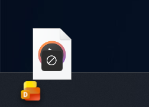

# Droply

**Droply** is a lightweight, minimalist Windows utility designed for instant file sharing. Drag, drop, and share—it's that simple.

---

## 📸 Preview

| Idle State | Uploading | Success |
| :---: | :---: | :---: |
|  |  |  |

---

## ✨ Features

* **Drag & Drop Simplicity**: Just drag any file onto the app icon docked above your taskbar.
* **Instant Sharing**: Automatically uploads your files via [Gofile.io](https://gofile.io/) and copies the download link to your clipboard.
* **Minimalist Design**: A sleek, dark-themed interface that respects the modern Windows Fluent Design aesthetic.
* **High Performance**: Uses stream-based processing to handle large files (up to 2GB) without consuming excessive memory.
* **Unobtrusive**: Discreetly sits above your taskbar, ready whenever you need it.

---

## 🚀 How to Use

1. **Launch** the application.
2. **Drag** a file from your computer.
3. **Drop** it onto the **Droply** icon.
4. **Wait** for the progress animation to complete.
5. The **link is copied** automatically to your clipboard!

---

## 🛠 Tech Stack

* **Language**: C#
* **Framework**: WPF (Windows Presentation Foundation)
* **API**: Gofile.io Upload API
* **Design**: Fluent Design principles with custom animations.

---

## 📦 Installation

1. Download the latest release from the [Releases page](https://www.google.com/search?q=https://github.com/your-username/Droply/releases).
2. Extract the zip file.
3. Run `Droply.exe`.

---

## 🤝 Contributing

Contributions are welcome! If you have a suggestion or find a bug, please:

1. Open an [Issue]().
2. Fork the repository.
3. Create a branch for your feature.
4. Submit a Pull Request.

---

## 📝 License

This project is licensed under the **MIT License**. See the `LICENSE` file for more details.

---

Do you want me to help you adjust the window title in your C# code or the `Title` property in your XAML to reflect the name **Droply**?
