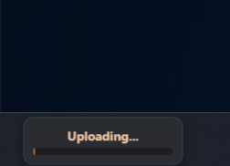

<h1>
  
  Droply
</h1>

---

**Droply** is a lightweight, minimalist Windows utility designed for instant file sharing. Drag, drop, and share—it's that simple.

---

## 📸 Preview

### Core Workflow
| Idle State | Uploading | Success |
| :---: | :---: | :---: |
|  |  |  |

### Context Menu & Settings Panel
| Context Menu | Settings (Dark Mode) | Settings (Light Mode) |
| :---: | :---: | :---: |
|  |  |  |

---

## ✨ Features

* **Drag & Drop Simplicity**: Just drag any file onto the app icon docked above your taskbar.
* **Instant Sharing**: Automatically uploads your files via [Gofile.io](https://gofile.io/) and copies the download link to your clipboard.
* **Customization & Themes**: Fully functional toggle between **Dark Mode** and **Light Mode** to match your desktop setup.
* **Discord Webhook Integration**: Optional field to link a Discord channel webhook. Once an upload finishes, a clean embed notification is automatically sent to your Discord server.
* **Flexible Startup Control**: Toggle the "Launch at startup" option directly from the settings window to keep your boot sequence clean.
* **Minimalist Design**: A sleek interface that respects the modern Windows Fluent Design aesthetic, complete with custom "Copied" toast animations.
* **High Performance**: Uses stream-based processing to handle large files (up to 2GB) without consuming excessive memory.

---

## 🚀 How to Use & Configure

1. **Launch** the application.
2. **Right-click** the system tray or settings icon to open the **Paramètres** (Settings) menu.
3. **Configure your preferences**:
   * Check **Lancer au démarrage** if you want Droply to open when Windows starts.
   * Toggle **Mode Clair** to switch interface styles instantly.
   * Paste your Discord URL into the **Discord Webhook** field for automated notification logging.
4. **Drag & Drop** any file onto the **Droply** icon to share it.
5. Once complete, the link is copied to your clipboard, and a Discord embed is sent (if configured)!

### Discord Integration Preview

---

## 🛠 Tech Stack

* **Language**: C#
* **Framework**: WPF (Windows Presentation Foundation)
* **API**: Gofile.io Upload API & Discord Webhooks
* **Design**: Fluent Design principles with custom UI animations.

---

## 📦 Installation

1. Download the latest `Droply.exe` from the [Releases page](https://github.com/legralltitouan/Droply/releases).
2. Place the executable in a folder of your choice.
3. Run `Droply.exe`.
4. *(Optional)* Open the Settings panel to enable the Windows startup shortcut manually.

---

## 🤝 Contributing

Contributions are welcome! If you have a suggestion or find a bug, please:

1. Open an [Issue](https://github.com/legralltitouan/Droply/issues).
2. Fork the repository.
3. Create a branch for your feature.
4. Submit a Pull Request.

---

## 📝 License

This project is licensed under the **MIT License**. See the `LICENSE` file for more details.

**Copyright (c) 2026 legralltitouan**
*Note: Non-commercial use only. Any modification or distribution of this software requires written permission from legralltitouan.*
